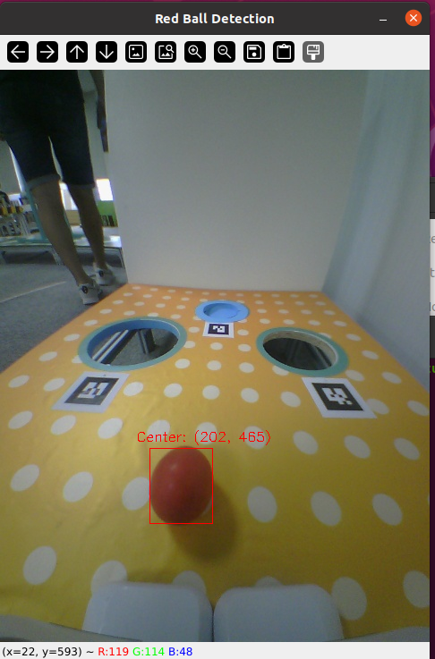
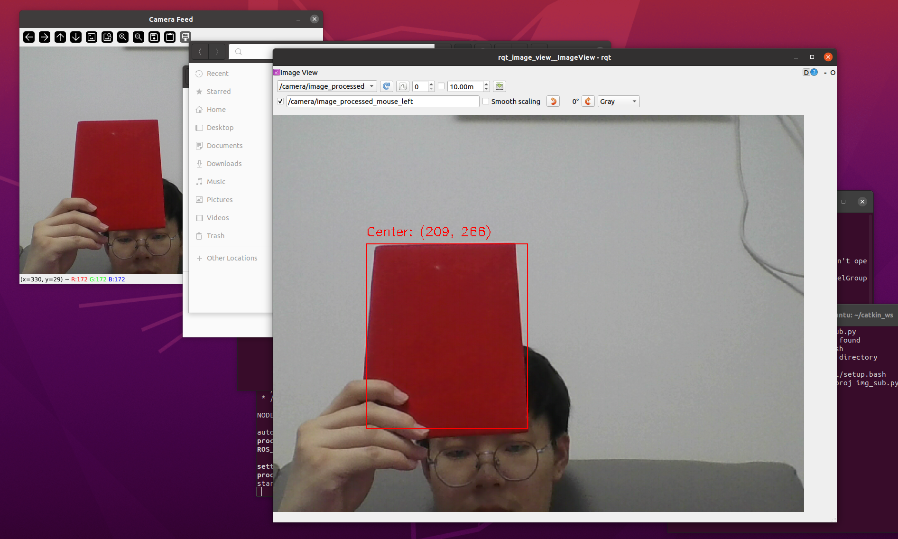
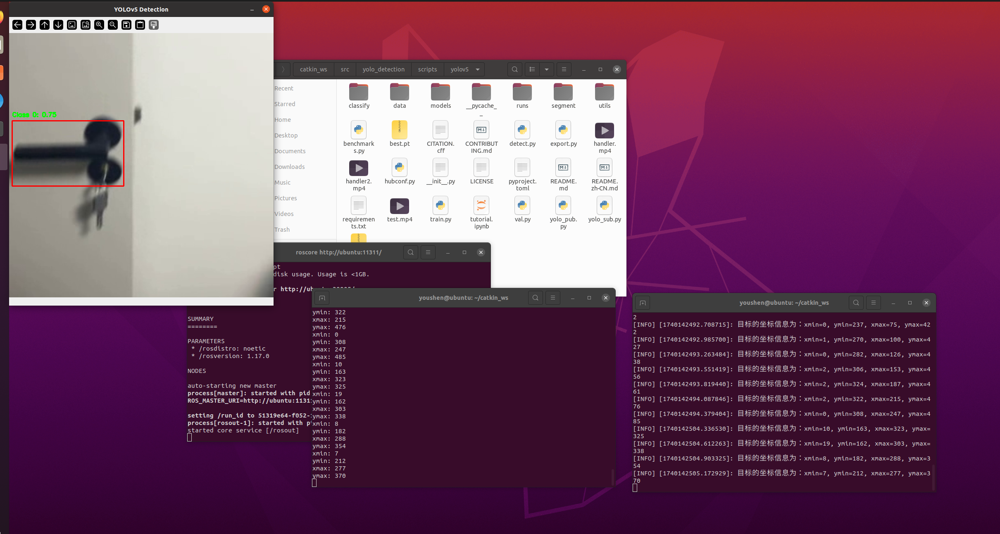

# Aelos&Roban 选拔任务  
## 1.1 基本任务
### 1.对下列图像进行处理, 通过python的opencv库函数实现将图像中的红色小球框选并输出其坐标 原图及识别效果图
任务源码：  
```py
import cv2
import numpy as np

# 读取图像
image = cv2.imread('image/red_ball.png')

# 将图像从BGR颜色空间转换为HSV颜色空间
hsv_image = cv2.cvtColor(image, cv2.COLOR_BGR2HSV)

# 定义红色的HSV范围
lower_red1 = np.array([0, 43, 46])
upper_red1 = np.array([10, 255, 255])
lower_red2 = np.array([156, 43, 46])
upper_red2 = np.array([180, 255, 255])

# 生成红色掩码，经过试验，发现2个mask的效果更好
mask1 = cv2.inRange(hsv_image, lower_red1, upper_red1)
mask2 = cv2.inRange(hsv_image, lower_red2, upper_red2)
mask = cv2.bitwise_or(mask1, mask2)

# 闭运算，去除噪声，并且填补红色区域的空洞
kernel = np.ones((5, 5), np.uint8)

mask = cv2.morphologyEx(mask, cv2.MORPH_CLOSE, kernel)
# 查找轮廓
contours, hierarchy = cv2.findContours(mask, cv2.RETR_EXTERNAL, cv2.CHAIN_APPROX_SIMPLE)

if contours:
    largest_contour = max(contours, key=cv2.contourArea)

    x, y, w, h = cv2.boundingRect(largest_contour)

    cv2.rectangle(image, (x, y), (x + w, y + h), (0, 0, 255), 1)
    # 获取中心点坐标
    x_site = x + w // 2
    y_site = y + h // 2
    coord_text = f"Center: ({x_site}, {y_site})"
    cv2.putText(image, coord_text, (x_site - 50, y_site - 50),
                cv2.FONT_HERSHEY_SIMPLEX, 0.5, (0, 0, 255), 1)

cv2.imshow('Red Ball Detection', image)
cv2.waitKey(0)
cv2.destroyAllWindows()
```
最终结果如下图所示：   

  
---

### 2.自主编写代码完成以下两个文件 img_pub.py（发布） 与 img_sub.py(订阅)，对给定图像进行处理  
发布端代码：  
```py
#!/usr/bin/env python
import rospy
import cv2
from sensor_msgs.msg import Image
from cv_bridge import CvBridge

def img_pub():
    # 初始化ROS节点
    rospy.init_node('img_pub', anonymous=True)
    
    # 创建Publisher，发布图像话题'camera/image_raw'
    pub = rospy.Publisher('camera/image_raw', Image, queue_size=10)
    
    # 创建CvBridge对象
    bridge = CvBridge()
    
    # 打开摄像头
    cap = cv2.VideoCapture(0)  # 0表示默认摄像头
    if not cap.isOpened():
        rospy.logerr("无法打开摄像头")
        return
    
    rate = rospy.Rate(10)  # 发布频率为10Hz
    while not rospy.is_shutdown():
        ret, frame = cap.read()
        if not ret:
            rospy.logerr("无法读取摄像头图像")
            break
        
        # 将OpenCV图像转换为ROS图像消息
        ros_image = bridge.cv2_to_imgmsg(frame, "bgr8")
        
        # 发布图像
        pub.publish(ros_image)
        
        # 显示图像
        cv2.imshow("Camera Feed", frame)
        if cv2.waitKey(1) & 0xFF == ord('q'):
            break
        
        rate.sleep()
    
    # 释放摄像头并关闭窗口
    cap.release()
    cv2.destroyAllWindows()

if __name__ == '__main__':
    try:
        img_pub()
    except rospy.ROSInterruptException:
        pass
```
订阅端代码：  
```py
#!/usr/bin/env python
import rospy
import cv2
import numpy as np
from sensor_msgs.msg import Image
from cv_bridge import CvBridge

class RedObjectDetector:
    def __init__(self):
        # 初始化ROS节点
        rospy.init_node('img_sub', anonymous=True)
        
        # 创建CvBridge对象
        self.bridge = CvBridge()
        
        # 订阅图像话题'camera/image_raw'
        self.image_sub = rospy.Subscriber('camera/image_raw', Image, self.image_callback)
        
        # 发布处理后的图像话题
        self.image_pub = rospy.Publisher('camera/image_processed', Image, queue_size=10)
    
    def image_callback(self, msg):
        try:
            # 将ROS图像消息转换为OpenCV图像
            cv_image = self.bridge.imgmsg_to_cv2(msg, "bgr8")
        except Exception as e:
            rospy.logerr(f"转换图像失败: {e}")
            return
        
        # 处理图像：提取红色物体
        hsv_image = cv2.cvtColor(cv_image, cv2.COLOR_BGR2HSV)
        
        # 定义红色的HSV范围，以下同任务1的识别小球，但是红色范围更精确一些
        lower_red1 = np.array([0, 170, 120])
        upper_red1 = np.array([8, 255, 255])
        lower_red2 = np.array([172, 170, 120])
        upper_red2 = np.array([180, 255, 255])
        
        # 创建掩码 
        mask1 = cv2.inRange(hsv_image, lower_red1, upper_red1)
        mask2 = cv2.inRange(hsv_image, lower_red2, upper_red2)
        mask = cv2.bitwise_or(mask1, mask2)
        
        # 形态学操作：去除噪声并填充空洞
        kernel = np.ones((5, 5), np.uint8)
        mask = cv2.morphologyEx(mask, cv2.MORPH_OPEN, kernel)
        mask = cv2.morphologyEx(mask, cv2.MORPH_CLOSE, kernel)
        
        # 查找轮廓
        contours, _ = cv2.findContours(mask, cv2.RETR_EXTERNAL, cv2.CHAIN_APPROX_SIMPLE)
        
        # 筛选轮廓并绘制矩形
        for contour in contours:
            area = cv2.contourArea(contour)
            if area < 100:  # 忽略太小的轮廓
                continue
            
            # 获取边界框
            x, y, w, h = cv2.boundingRect(contour)
            
            # 绘制矩形
            cv2.rectangle(cv_image, (x, y), (x + w, y + h), (0, 0, 255), 1)
            
            # 打印坐标
            coord_text = f"Center: ({x + w // 2}, {y + h // 2})"
            cv2.putText(cv_image, coord_text, (x, y - 10), cv2.FONT_HERSHEY_SIMPLEX, 0.5, (0, 0, 255), 1)
        
        # 发布处理后的图像
        try:
            ros_image = self.bridge.cv2_to_imgmsg(cv_image, "bgr8")
            self.image_pub.publish(ros_image)
        except Exception as e:
            rospy.logerr(f"发布图像失败: {e}")

if __name__ == '__main__':
    try:
        detector = RedObjectDetector()
        rospy.spin()
    except rospy.ROSInterruptException:
        pass

```
执行结果：
  
可以看到图像话题被订阅端接收并进行处理。然后打印出中心坐标    
---

## 1.2 进阶任务  
### 跑通yolo识别框架，完成基础的图像识别功能  
代码如下：  
首先训练给定的handler训练集，yaml文件如下所示：
```yaml
path: /home/youshen/YOLO_dataset
train: images/
val: images/

nc: 1
names: ['handler']
```  
训练后得到best.pt文件，加入代码中进行演示  
发布端代码：
```py
#!/usr/bin/env python
import cv2
import torch
import rospy
from models.experimental import attempt_load
from utils.general import non_max_suppression
from yolo_detection.msg import yolo_msg
import platform
import pathlib
plt = platform.system()
if plt != 'Windows':
  pathlib.WindowsPath = pathlib.PosixPath

# 加载YOLOv5模型（使用本地权重文件）
model = attempt_load("/home/youshen/catkin_ws/src/yolo_detection/scripts/yolov5/best.pt",device = 'cpu')
# 设置检测参数
model.conf = 0.25  # 置信度阈值
model.iou = 0.45   # NMS IoU阈值

# 初始化ROS节点
rospy.init_node("yolo_ros_pub")
pub = rospy.Publisher("yolo_msg", yolo_msg, queue_size=10)

# 打开摄像头或者读取视频，该演示为读取视频
#cap = cv2.VideoCapture(0)
video_path = '/home/youshen/catkin_ws/src/yolo_detection/scripts/yolov5/handler2.mp4'
cap = cv2.VideoCapture(video_path)

try:
    while not rospy.is_shutdown():
        # 读取视频帧
        ret, frame = cap.read()
        if not ret:
            rospy.logwarn("Failed to capture video frame")
            continue
        frame = cv2.resize(frame, (640, 640))
        # 将OpenCV的numpy.ndarray转换为PyTorch的Tensor
        frame_tensor = torch.from_numpy(frame).float()  # 转换为float类型
        frame_tensor = frame_tensor.permute(2, 0, 1)   # 调整维度顺序为 [C, H, W]
        frame_tensor = frame_tensor.unsqueeze(0)       # 添加batch维度 [1, C, H, W]
        frame_tensor = frame_tensor / 255.0            # 归一化到 [0, 1]

        # YOLOv5推理
        results = model(frame_tensor)
        # 检查推理结果的类型
        if isinstance(results, tuple):
            # 如果结果是tuple，提取第一个元素（模型的原始输出）
            raw_output = results[0]
        else:
            raw_output = results

        # 应用非极大值抑制（NMS）进行后处理
        pred = non_max_suppression(raw_output, conf_thres=0.25, iou_thres=0.45)

        # 提取检测结果
        if len(pred) > 0:
            detections = pred[0].cpu().numpy()  # 提取第一个batch的结果
        else:
            detections = []

        # 发布每个检测目标
        for det in detections:
            xmin, ymin, xmax, ymax, _, _ = det
            msg = yolo_msg()
            msg.xmin = int(xmin)
            msg.ymin = int(ymin)
            msg.xmax = int(xmax)
            msg.ymax = int(ymax)
            pub.publish(msg)
            print(msg)
         
        if len(pred) > 0:
            # 手动绘制检测框
            for det in detections:
                xmin, ymin, xmax, ymax, conf, cls = det
                cv2.rectangle(frame, (int(xmin), int(ymin)), (int(xmax), int(ymax)), (0, 0, 255), 2)
                label = f"Class {int(cls)}: {float(conf):.2f}"
                cv2.putText(frame, label, (int(xmin), int(ymin) - 10), cv2.FONT_HERSHEY_SIMPLEX, 0.5, (0, 255, 0), 2)
            cv2.imshow('YOLOv5 Detection', frame)
        if cv2.waitKey(1) & 0xFF == ord('q'):
            break

finally:
    cap.release()
    cv2.destroyAllWindows()
    rospy.loginfo("YOLOv5 node shutdown")
```
订阅端代码：

```py
#!/usr/bin/env python
import rospy
from yolo_detection.msg import yolo_msg

def callback(data):
    rospy.loginfo("目标的坐标信息为：xmin=%d, ymin=%d, xmax=%d, ymax=%d",
                  data.xmin, data.ymin, data.xmax, data.ymax)

def yolo_ros_sub():
    rospy.init_node('yolo_ros_sub', anonymous=True)
    rospy.Subscriber('yolo_msg', yolo_msg, callback)
    rospy.spin()

if __name__ == '__main__':
    yolo_ros_sub()
```
执行结果：  

可以看到门把手被检测到并通过topic话题发布

---
## 1.3 SLAM任务  
### 采用的基本框架为ORB-SLAM2，需要跟随高翔视觉SLAM14讲（b站课程进行学习），至少了解其基本原理  
在b站上学习了SLAM的内容，了解了SLAM框架、三维空间刚体运动、 李群与李代数、相机与图像等章节  

## 1.4 文档说明  
1.1的第一个任务代码在open_cv_test中  
1.1的第二个任务代码在ros_proj中  
1.2由于yolo框架超过100个文件就没上传，只上传了重要的代码，有训练的best.pt，handler检测视频，训练的yaml文件，以及yolo_pub.py（发布端代码）和yolo_sub.py（订阅端代码）  
整个的讲解视频在issue区中。  
